[](https://classroom.github.com/a/_rEaNyCz)
# NAVBAR
sticky
```html
    <header>
        
        <ul>
            <li><a href="#">Home</a></li>
            <li><a href="#">About</a></li>
            <li><a href="#">Menu</a></li>
            <li><a href="#">Contact</a></li>
        </ul>
    </header>
```

Media query 
```css
 .hamburger {
        display: block;

    }

    .hamburger.active .bar:nth-child(2) {
        opacity: 0;
    }

    .hamburger.active .bar:nth-child(1) {
        transform: translateY(8px) rotate(45deg);
    }

    .hamburger.active .bar:nth-child(3) {
        transform: translateY(-8px) rotate(-45deg);
    }

    .nav-menu {
        position: fixed;
        left: -1000%;
        top: 70px;
        gap: 0;
        flex-direction: column;
        background-color: black;
        width: 100%;
        text-align: center;
        transition: 0.3s;


    }

    .nav-item {
        margin: 16px 0;
    }

    .nav-menu .active {
        left: 0;
    }

```

# MENU CONTENT
this is the content
```html
<h1>Our Menu</h1>
        <div class="flex-container container">
            <div class="menu-container">
                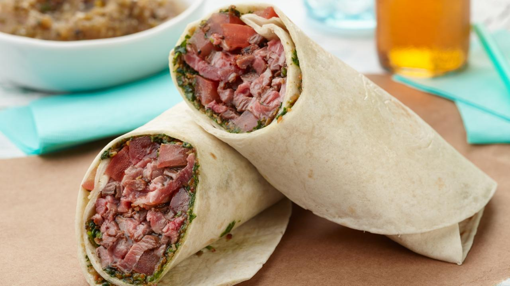
                <h3>Burito Carne Asada</h3>
                <h5>Burito filled with Mexican authentuic grilled meat</h5>
            </div>
            <div class="menu-container">
                
                <h3>Burito Pollo con Chille</h3>
                <h5>Burito filled with spicy chicken</h5>
            </div>
            <div class="menu-container">
                
                <h3>Burger</h3>
                <h5>Special burger by our restaurant that will crave your gut</h5>
            </div>
        </div>
```

Media quey for Content 
```css
 .grid-container {
        display: grid;
        grid-template-rows: 1fr 1fr 1fr;
        grid-template-columns: 1fr;
        width: 100%;
        margin-left: 0;
        margin-right: 0;
        padding-left: 0;
        padding-right: 0;

    }
```
# OUR GALLERY
```html
    <div class="gallery">
            <h1>Our Gallery</h1>
            <div class="grid-gallery">
                <picture class="grid-item1 child">
                    <source srcset="mexican_flag.png" media="(min-width: 600px)">
                    
                </picture>
                
                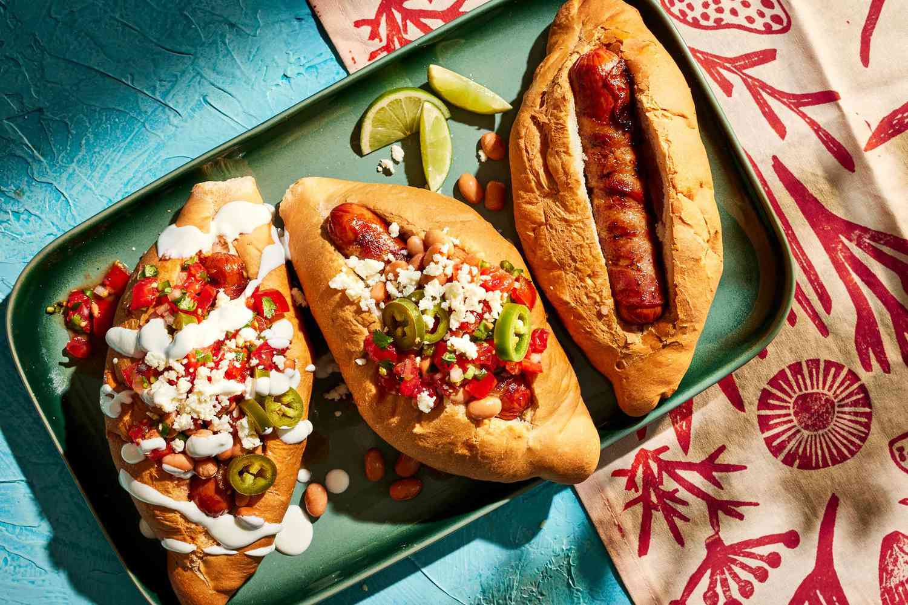
                
                <div class="grid-item5">
                    <h2 class="text">Happy Taco</h2>
                    <h2 class="text">Happy Tummy</h2>
                </div>
            </div>
        </div>
```
# ABOUT US
```html
    <div class="aboutUs container">
            <h1 class="aboutUs-text">About Us</h1>
            <h3 class="aboutUs-text">Lorem ipsum dolor sit amet consectetur adipisicing elit. Exercitationem, atque!
                Porro magnam odio
                similique officia, architecto nulla minima reprehenderit incidunt adipisci, labore cupiditate!
                Voluptate, ratione?
            </h3>
            <ul class="aboutUs-text">
                <li>Lorem ipsum dolor sit amet consectetur adipisicing elit. Asperiores, id.</li>
                <li>Lorem ipsum dolor, sit amet consectetur adipisicing elit. Sequi, quasi.</li>
                <li>Lorem ipsum dolor sit amet consectetur adipisicing elit. Natus, quasi!</li>
            </ul>
        </div>
```

# HOW TO REACH US
```html
    <div class="container">
            <h3>Contact Us</h3>
            <form action="">
                <div class="contactUs">
                    <input type="text" id="fname" name="fname" placeholder="Your Name">
                    <input type="text" id="email" name="email" placeholder="Your email">
                </div>
                <textarea name="" id="" cols="30" rows="10">Your Message</textarea>
                <input type="submit">

            </form>
        </div>
```
Pictures inside the content :


<br>
<br>
<br>
<br>
<br>

# How to deploy 

First, you need to signing up in Vercel or Netlify. I choosed Vercel since there was an issue while signing up via github.

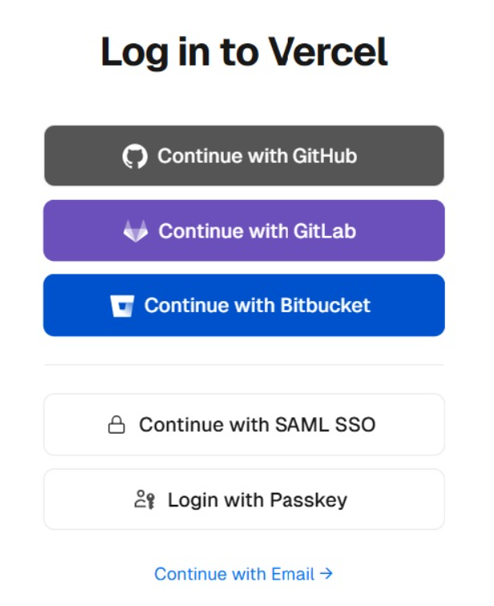

Second, add the domain (that previously been bought) to the project. 
note: the domain purchasement steps will be shown after this section

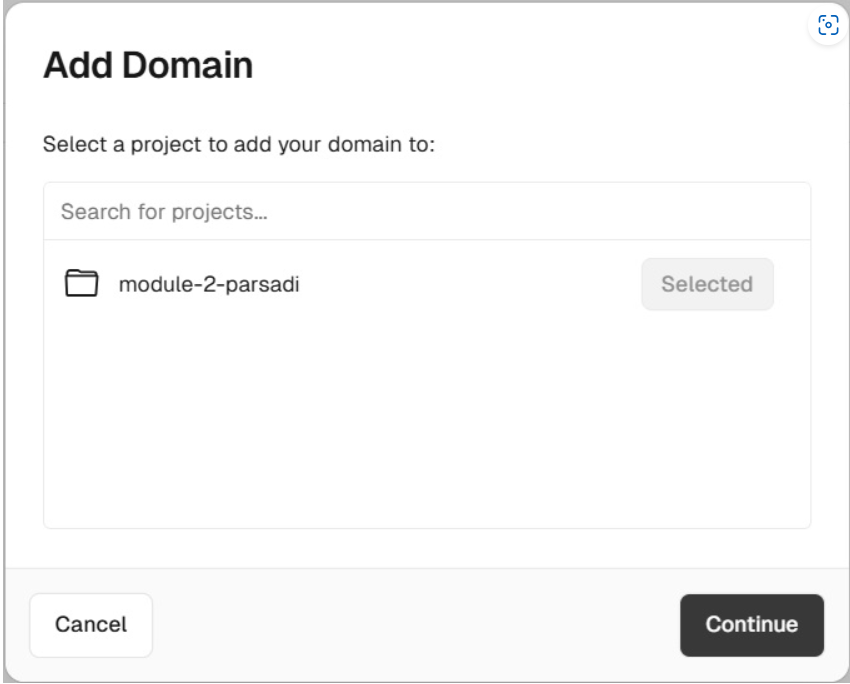

Third,Then here it comes, the domain that has linked to your intention project.

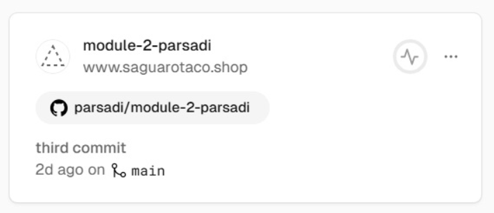

# How to buy domain

First,Type yout intended domain name, then choose your domain extension (I bought this domain at Niagahoster)

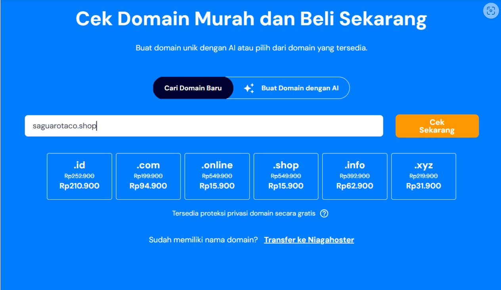

Then,Purchase that and you are set with your own domain. Congratulatiuon.

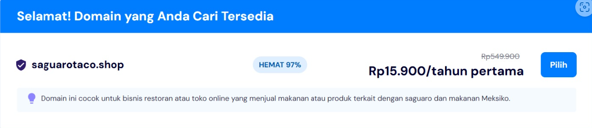

Third, set the DNS. Go back to your Vercel account, then click "add" on the red circle

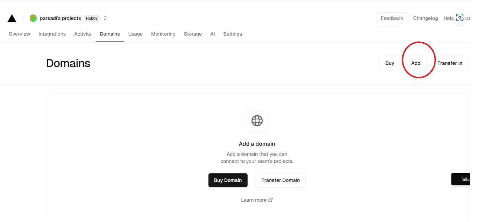

Then,add your domain to the project from your gitHub


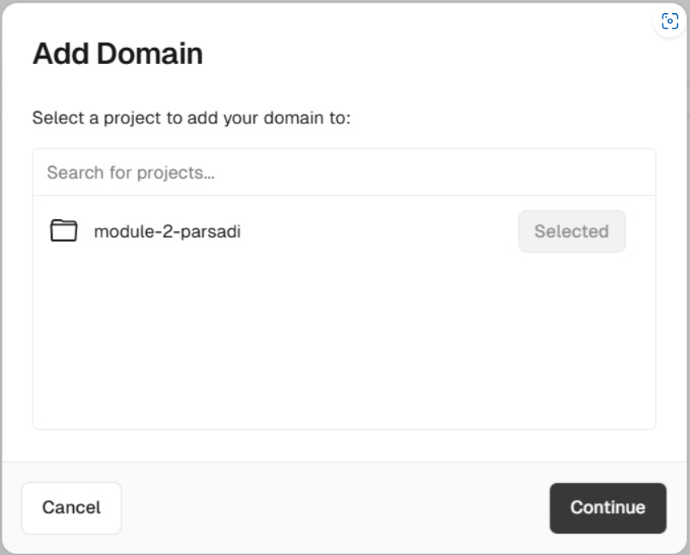

Add your domain


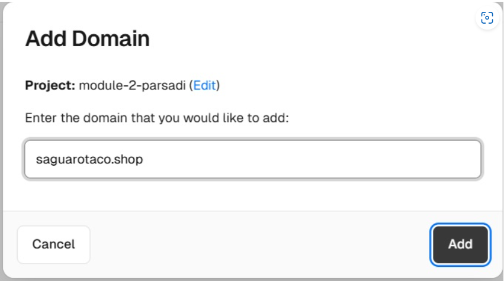

Then, go to "settings", then click "domains" at the left side-bar, then copy the value as depicted on the picture above.


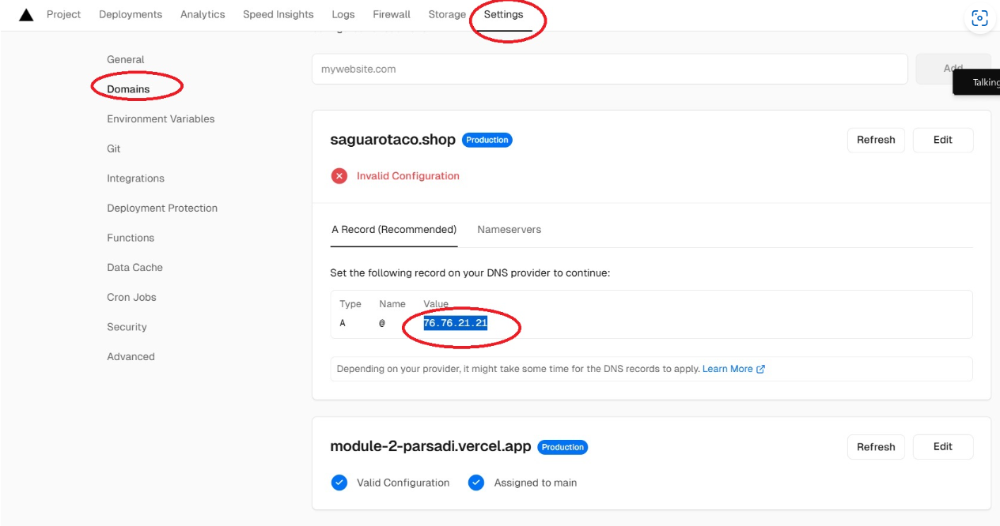

Finally,Copy that on your "Niagahoster" and you are all set. Congratulation, you are just launched your first website.

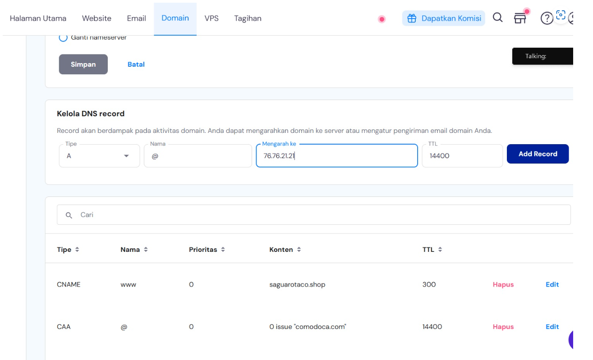

# Deployment link

https://www.saguarotaco.shop/


